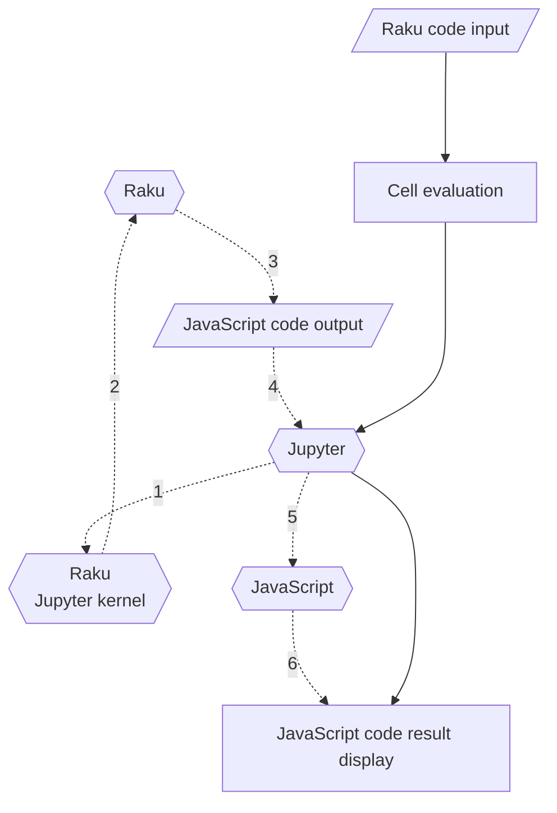

# JavaScript::Google::Charts

This repository has the Raku package for generation of 
the [JavaScript Google Charts](https://developers.google.com/chart) 
code for making plots and charts.

This package is intended to be used in Jupyter notebooks with the
[Raku kernel implemented by Brian Duggan](https://github.com/bduggan/raku-jupyter-kernel), [BD1], or
["Jupyter::Chatbook"](https://github.com/antononcube/Raku-Jupyter-Chatbook), [AAp4].
The commands of the package generate JavaScript code that produces (nice) 
[Google Charts plots or charts](https://developers.google.com/chart/interactive/docs/gallery).

The package JavaScript graphs can be also included in HTML and Markdown documents.

One nice feature of Google Charts is that it allows the download of the plots and charts made with it.

--------

## Mission statement

Make first class -- beautiful, tunable, and useful -- plots and charts with Raku using 
concise specifications.

--------

## Design and philosophy

Here is a list of guiding design principles:

- Google Charts gives a simple user interface, hence, we preserve and follow it as much as we can
- Make Google Charts' documentation completely applicable for the implemented functions
  - That documentation is very detailed and high quality.
  - *(Raku is just "conduit" to Google Charts.)*
- Facilitate the use of data simpler than that required by Google Charts
  - For example, just giving a list of numbers to a scatter plot should work.
- Facilitate the generation of both HTML code and (just) JavaScript code
- Keep the implementation simple
  - Do not to try to make an extensive interface to Google Charts or have complicated code snippets system.
    - *(Like the efforts in ["JavaScript::D3"](https://raku.land/zef:antononcube/JavaScript::D3).)*
  
--------

## The chart types currently implemented 

<table>
  <tr>
    <th>Chart Type</th>
    <th>Chart Type</th>
    <th>Chart Type</th>
  </tr>
  <tr>
    <td>Annotated Timeline &#x25A2;</td>
    <td>Area Chart &#x2713;</td>
    <td>Bar Chart &#x2713;</td>
  </tr>
  <tr>
    <td>Bubble Chart &#x2713;</td>
    <td>Calendar Chart &#x25A2;</td>
    <td>Candlestick Chart &#x25A2;</td>
  </tr>
  <tr>
    <td>Column Chart &#x2713;</td>
    <td>Combo Chart &#x25A2;</td>
    <td>Gauge &#x2713;</td>
  </tr>
  <tr>
    <td>Geo Chart &#x2713;</td>
    <td>Histogram &#x2713;</td>
    <td>Line Chart &#x2713;</td>
  </tr>
  <tr>
    <td>Org Chart &#x25A2;</td>
    <td>Pie Chart &#x2713;</td>
    <td>Sankey Diagram &#x2713;</td>
  </tr>
  <tr>
    <td>Scatter Chart &#x2713;</td>
    <td>Stepped Area Chart &#x2713;</td>
    <td>Timeline &#x2713;</td>
  </tr>
  <tr>
    <td>TreeMap &#x2713;</td>
    <td>Waterfall Chart &#x25A2;</td>
    <td>Word Tree &#x2713;</td>
  </tr>
</table>


--------

## How does it work?

Here is a diagram that summarizes the evaluation path from a Raku plot spec to a browser diagram:



Here is the corresponding narration:

1. Enter Raku plot command in cell that starts with 
   [the magic spec `%% js`](https://github.com/bduggan/raku-jupyter-kernel/issues/100#issuecomment-1349494169).

   - Like `js-google-charts-plot('Scatter', (^12)>>.rand)`.
   
2. Jupyter via the Raku kernel evaluates the Raku plot command.

3. The Raku plot command produces JavaScript code.

4. The Jupyter "lets" the web browser to evaluate the obtained JavaScript code.

   - Instead of web browser, say, Visual Studio Code can be used.

   
The evaluation loop spelled out above is possible because of the magics implementation in the Raku package
[Jupyter::Kernel](https://github.com/bduggan/raku-jupyter-kernel#features), 
[BD1].
   
--------

## Alternatives

### Raku packages

The Raku package 
["JavaScript::D3"](https://raku.land/zef:antononcube/JavaScript::D3), [AAp1, AAv1],
provides a similar set of JavaScript computed plots and charts using the library [D3.js](https://d3js.org).

D3.js is (much more) of lower level library than Google Charts. 

**Remark:** Google Charts is customizable, but its set of plots and charts is a streamlined 
and relatively rigid compared to D3.js.

The Raku packages "Text::Plot", [AAp2] and "SVG::Plot", [MLp1],
provide similar functionalities and both can be used in Jupyter notebooks. 
(Well, "Text::Plot" can be used anywhere.)

--------

## Examples

### [Scatter plot](https://developers-dot-devsite-v2-prod.appspot.com/chart/interactive/docs/gallery/scatterchart)

```perl6, eval=FALSE
use JavaScript::Google::Charts;

my @res = 120.rand xx 12;

js-google-charts('Scatter', @res, format => 'html', :png-button);
```


### [Bubble chart](https://developers-dot-devsite-v2-prod.appspot.com/chart/interactive/docs/gallery/bubblechart)

```perl6, eval=FALSE
my @res2 = [('A'..'Z').pick, 120.rand, 130.rand, <a b>.pick, 10.rand] xx 12;

@res2 = @res2.map({ <label x y group z>.Array Z=> $_.Array })».Hash; 

js-google-charts('Bubble', @res2, column-names => <label x y group z>, format => 'html', :png-button, div-id => 'bubble');
```


--------

## References

### Articles

[OV1] Olivia Vane, 
["D3 JavaScript visualisation in a Python Jupyter notebook"](https://livingwithmachines.ac.uk/d3-javascript-visualisation-in-a-python-jupyter-notebook), 
(2020), 
[livingwithmachines.ac.uk](https://livingwithmachines.ac.uk).

[SF1] Stefaan Lippens, 
[Custom D3.js Visualization in a Jupyter Notebook](https://www.stefaanlippens.net/jupyter-custom-d3-visualization.html), 
(2018), 
[stefaanlippens.net](https://www.stefaanlippens.net).

### Packages

[AAp1] Anton Antonov,
[JavaScript::D3 Raku package](https://raku.land/zef:antononcube/Text::Plot),
(2022-2024),
[GitHub/antononcube](https://github.com/antononcube/Raku-JavaScript-D3).

[AAp1] Anton Antonov,
[Text::Plot Raku package](https://raku.land/zef:antononcube/Text::Plot),
(2022),
[GitHub/antononcube](https://github.com/antononcube/Raku-Text-Plot).

[AAp3] Anton Antonov,
[JavaScriptD3 Python package](https://github.com/antononcube/Python-packages/tree/main/JavaScriptD3),
(2022),
[Python-packages at GitHub/antononcube](https://github.com/antononcube/Python-packages).

[AAp4] Anton Antonov,
[Jupyter::Chatbook Raku package](https://github.com/antononcube/Raku-Jupyter-Chatbook),
(2023-2024),
[GitHub/antononcube](https://github.com/antononcube).

[BD1] Brian Duggan,
[Jupyter::Kernel Raku package](https://raku.land/cpan:BDUGGAN/Jupyter::Kernel),
(2017-2022),
[GitHub/bduggan](https://github.com/bduggan/raku-jupyter-kernel).

[MLp1] Moritz Lenz,
[SVG::Plot Raku package](https://github.com/moritz/svg-plot)
(2009-2018),
[GitHub/moritz](https://github.com/moritz/svg-plot).

### Videos

[AAv1] Anton Antonov,
["The Raku-ju hijack hack for D3.js"](https://www.youtube.com/watch?v=YIhx3FBWayo),
(2022),
[YouTube/@AAA4Prediction](https://www.youtube.com/@AAA4prediction).